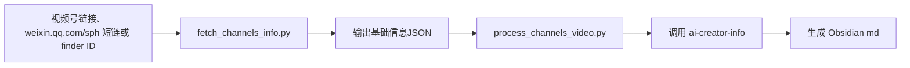

# 视频号创作者信息查询 Skill 使用指南

## 设计思路



这条链路现在严格对齐 `bilibili-up-info` + `ai-creator-info` 的职责拆分：
- 上游只拉创作者基础信息
- 下游只把 JSON 生成 md

不再下载封面图，不再下载视频，不再做语音转写。

## 使用模式

### 1. 只查创作者基础信息

```bash
python3 视频号/channels-video-processor/scripts/fetch_channels_info.py \
  "https://channels.weixin.qq.com/finder-preview/pages/sph?id=ANFZXzn3N9"
```

`weixin.qq.com/sph/...` 会直接判断为微信视频号短链：

```bash
python3 视频号/channels-video-processor/scripts/fetch_channels_info.py \
  "https://weixin.qq.com/sph/Av0dEnlvVz"
```

输出字段：
- `name`
- `intro`
- `avatar_url`
- `space_url`
- `finder_id`

### 2. 查询后直接生成 md

```bash
python3 视频号/channels-video-processor/scripts/process_channels_video.py \
  "https://channels.weixin.qq.com/finder-preview/pages/sph?id=ANFZXzn3N9" \
  --category "AI 创作者" \
  --stars 4
```

这里的 `--category` 和 `--stars` 现在是必填项。调用前先问用户，不再允许静默默认。

在 AI-Master / Obsidian 资料库场景下，如果用户给出视频号链接是为了记录 AI 创作者，不要停在基础 JSON。正确交互是：

1. 先调用 `fetch_channels_info.py` 查询并展示 JSON。
2. 询问分类：`AI 大神`、`AI 创作者`、`两者都是`。
3. 询问星级：`1-5`。
4. 复用同一份 JSON 调用 `process_channels_video.py` 创建 md。

### 3. 复用已有 JSON 生成 md

```bash
python3 视频号/channels-video-processor/scripts/process_channels_video.py \
  --json-file /tmp/channels_creator.json \
  --category "AI 创作者" \
  --stars 4
```

## 依赖安装

```bash
python3 -m pip install requests
```

`ai-creator-info` 生成脚本只依赖 Python 标准库，不需要额外安装。

## 结果说明

- `fetch_channels_info.py` 输出与 `bilibili-up-info` 兼容的基础资料 JSON
- `process_channels_video.py` 会继续调用 `B站/ai-creator-info/scripts/generate_profile.py`
- 生成的 md 平台字段会写成 `视频号`，不再固定写成 `B站`
- 生成 md 前必须拿到用户明确给出的分类和星级
